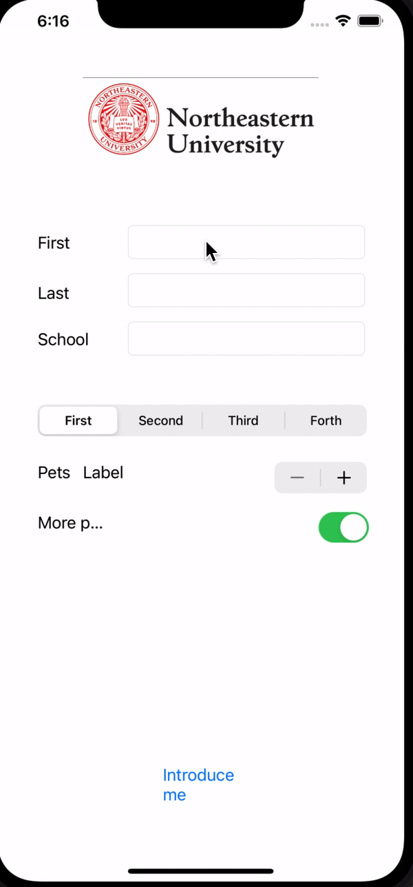

## Introduce Myself

### App Description

This app achieves the basic features in ios development, including view components, actions and buttons. User can input information and when clicking the "introduce me" button, there will be an alert shows all your input information.

### App Walk-though

### Achieved Features

- App displays an image of a school's logo
- App has three textfields for first, last, and school names
- App has a segmented control that changes student year
- Number of pet matches label is increased/decreased by stepper
- Switch makes a statement about wanting more pets or not(true/false)
- Introduce yourself button shows alert box with an introduciton and dismiss button

